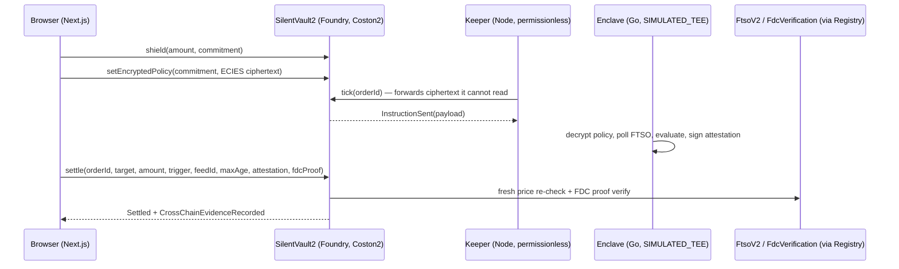

# SILENT 2.0 — Confidential Treasury OS with Attested Redemption

**The private institutional treasury and settlement rail for XRP on Flare.**

XRP is a $150B asset, but every FXRP position, redemption, and payroll flow on
Flare today is public — balances, liquidation prices, and treasury moves leak
straight to MEV and front-runners. FXRP TVL has stuck around $170M–$236M
despite a 2.2B FLR incentive program; we don't claim public balances are the
*only* reason (bridging friction and awareness matter too), but it's a real,
addressable one — no institution puts a $10M treasury somewhere its stop-loss
price is readable by every MEV bot watching the mempool.

SILENT 2.0 shields FXRP behind a commitment hash and encrypts each treasury's
policy — stop-loss, trailing stop, payroll batch, or a guaranteed XRPL
redemption — client-side to a TEE's public key. A permissionless keeper
forwards that ciphertext without ever decrypting it. The TEE decrypts inside
the enclave, polls FTSO privately, evaluates the policy, and signs a
settlement attestation. The chain never trusts that attestation blindly:
`settle()` independently re-reads a *fresh* FTSO price and requires
`price <= revealedTrigger` and freshness `<= 300s`, and for redemptions,
verifies an FDC Merkle proof of the actual XRPL payment before recording it
as on-chain evidence.

**The privacy guarantee itself runs in `SIMULATED_TEE` mode today** — a
normal Go process with a software keypair, not attested hardware (see
[`docs/TRUST.md`](docs/TRUST.md)). The on-chain verification path (signature
allowlist, fresh price re-check, FDC proof) is real and live on Coston2;
what's simulated is the enclave's hardware trust root. We're stating that
here, not just in the docs, because judging this fairly means judging it
against what's actually running, not what the architecture would support
once that one piece is real.

**Read [`docs/TRUST.md`](docs/TRUST.md) before treating any of this as
audited — it documents exactly what SIMULATED_TEE mode does and does not
guarantee.**

## Architecture



Full diagram, byte-level protocol coupling, and the 4-policy design are in
[`docs/ARCHITECTURE.md`](docs/ARCHITECTURE.md).

## Deployed addresses (Coston2, chainId 114)

| Contract | Address |
|---|---|
| SilentVault2 | [`0x7a71e3D15a3B4E4Be6334D62A9d2C35042C987C0`](https://coston2-explorer.flare.network/address/0x7a71e3D15a3B4E4Be6334D62A9d2C35042C987C0) |
| SilentPolicyRegistry | [`0xCB721Fa081Faf75af9b4E94083d1483115505085`](https://coston2-explorer.flare.network/address/0xCB721Fa081Faf75af9b4E94083d1483115505085) |
| FlareContractRegistry (Flare-provided) | `0xaD67FE66660Fb8dFE9d6b1b4240d8650e30F6019` |
| FXRP (Coston2 reference) | `0x0b6A3645c240605887a5532109323A3E12273dc7` |

Full deploy log, tx hash, and post-deploy health check in
[`docs/DEPLOY.md`](docs/DEPLOY.md).

## How Flare is used — all 4 primitives

1. **FAssets** — `SilentVault2.shield()` custodies real FXRP via `SafeERC20`;
   `assetManager()` resolves the live `AssetManagerFXRP` through
   `FlareContractRegistry`, never hardcoded.
2. **FTSO** — the TEE polls FTSO privately to evaluate policies
   (`extension/internal/watcher`), and `settle()` independently re-reads
   `FtsoV2.getFeedById` on-chain and requires the price and freshness
   conditions to still hold — a stale or manipulated off-chain decision
   cannot execute.
3. **FCC (Flare Confidential Compute)** — the entire private-policy flow is
   impossible without a TEE: `tick()` emits `InstructionSent` for a
   production FCC deployment to consume directly; this build's
   `extension/cmd/enclave` implements the identical interface in documented
   `SIMULATED_TEE` mode.
4. **FDC (Flare Data Connector)** — `GuaranteedRedeem` settlement verifies an
   `IFdcVerification.verifyPayment` Merkle proof of the XRPL-side redemption
   before recording `CrossChainEvidenceRecorded` — cross-chain evidence, not
   a claim.

## How to run

```bash
forge test -vv                                          # 30 contract tests
cd extension && go vet ./... && go test ./... -race      # 24 Go tests
cd keeper && npm install && npm test                     # 12 keeper tests
cd frontend && npm install && npm run build               # typecheck + build
```

Full local dev instructions (running the enclave, keeper, and frontend
together against a live or your own deployment) are in
[`docs/DEPLOY.md`](docs/DEPLOY.md).

## Judging criteria mapping

1. **Product usefulness** — solves the exact reason FXRP TVL is stuck:
   institutions won't bring treasury on-chain while it's public. SILENT is
   what makes the 2.2B FLR incentive program work for real treasuries, not
   mercenary farmers.
2. **Flare integration quality** — all 4 primitives (FAssets, FTSO, FCC, FDC)
   wired through `FlareContractRegistry`, never hardcoded beyond the
   registry itself; see `docs/ARCHITECTURE.md` for the exact coupling.
3. **Technical execution** — Foundry (30 tests), Go `-race`-clean (24 tests),
   Node keeper (12 tests), Next.js build all green; deployed and
   health-checked live on Coston2 (`docs/DEPLOY.md`); the ECIES
   client↔enclave wire format was verified with a real cross-language
   round-trip during development, not just unit-tested independently.
4. **Evidence of new work** — everything in `contracts/`, `extension/`,
   `keeper/`, `frontend/`, and `docs/` was built for this submission on a
   from-scratch Foundry/Go/Next.js stack (the prior Hardhat/Python SILENT 1.0
   was removed, not iterated on).
5. **Clarity** — this README, `docs/ARCHITECTURE.md`, `docs/TRUST.md`,
   `SUBMISSION.md`, and `DEMO_SCRIPT.md` map the product, the Flare
   integration, the trust model, and the pitch.

## Why this beats the field

Most Summer Signal entries pick one dimension to go deep on — a settlement
layer, a TEE demo, an oracle re-check, an FDC proof. SILENT 2.0 chains all
four into one product because removing any one of them breaks the core
claim: private standing intent, backed by an attested (today: simulated,
architecturally identical) settlement path, backed by an on-chain price
re-check that doesn't blindly trust the TEE, backed by real cross-chain
evidence for redemptions. And it says so honestly — `docs/TRUST.md` lists
exactly what's simulated vs. real, because judges (and the institutions this
is actually for) trust a team that states its limitations more than one that
doesn't have any to state.

**Winning narrative:** SILENT 2.0 is the treasury rail XRP treasuries need
before putting $10M on-chain — private standing intent plus attested
redemption. It makes the 2.2B FLR incentive program work for institutions,
not farmers.

## Roadmap

- **Week 1**: Uphold tag-mint integration for 1-tx FXRP onboarding;
  Firelight stXRP as a yield-bearing shield target.
- **Month 1**: security audit, pilot with 2 XRP treasuries.
- **Q4**: Flare mainnet deployment, FBTC support.

## Video


_placeholder — demo video of the project link goes here_
