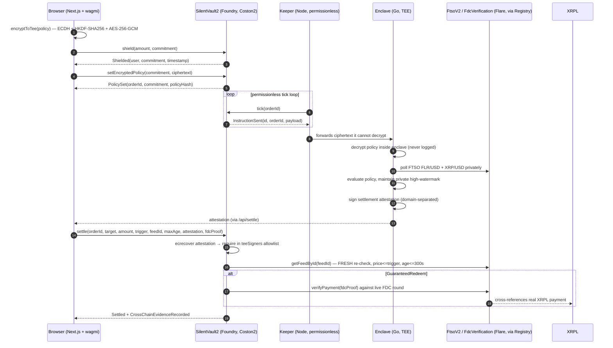
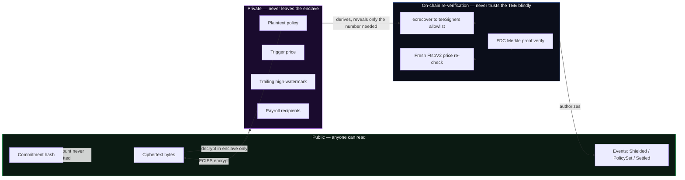
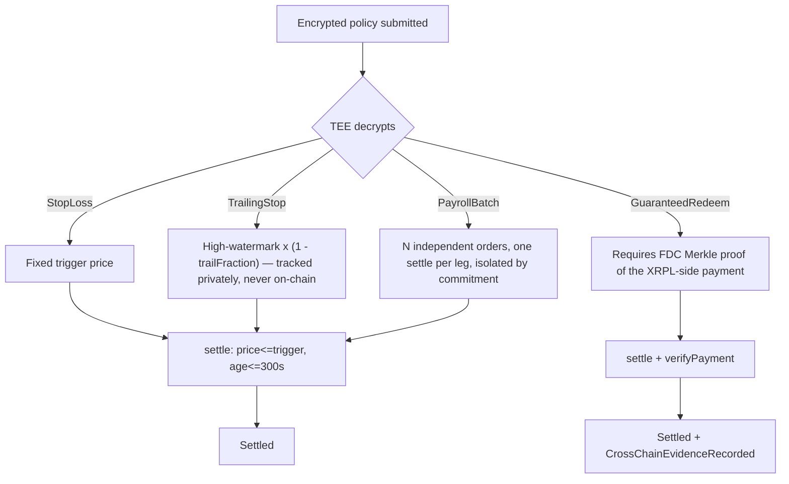
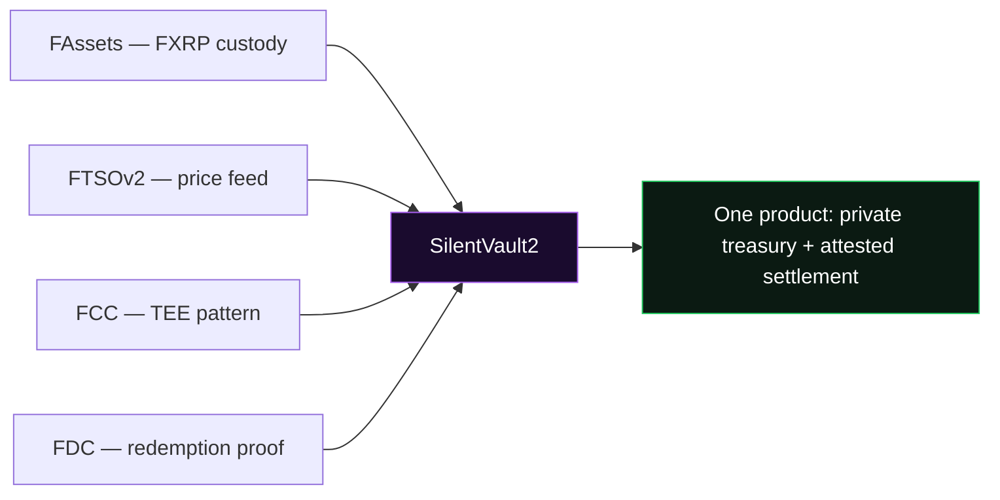
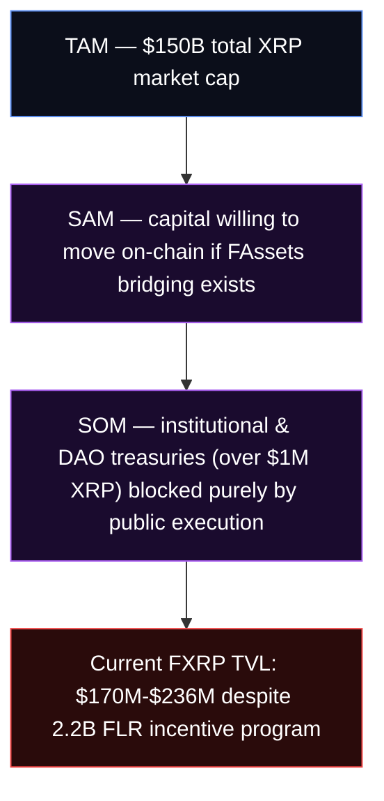
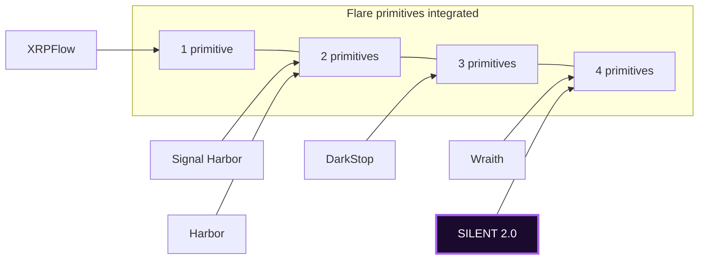
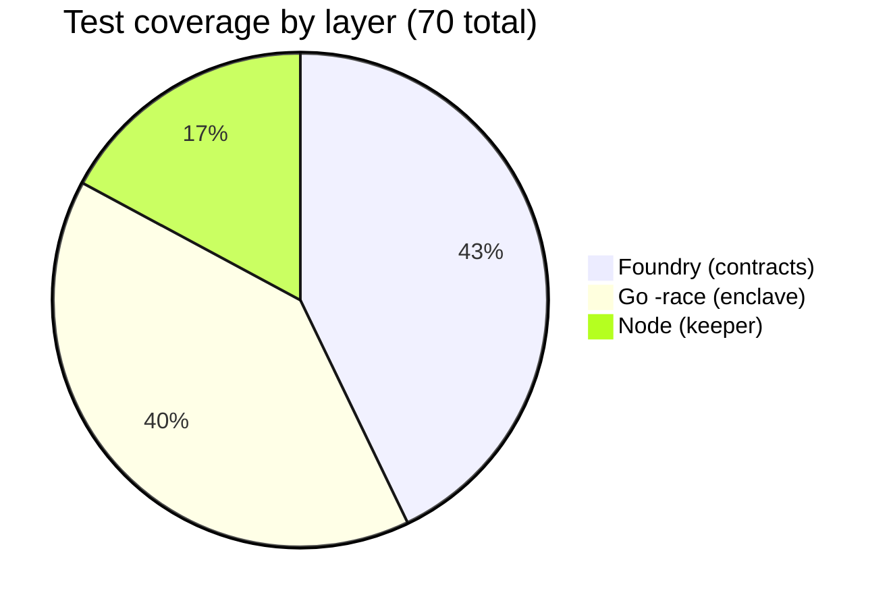
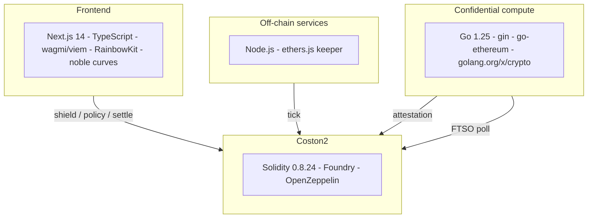
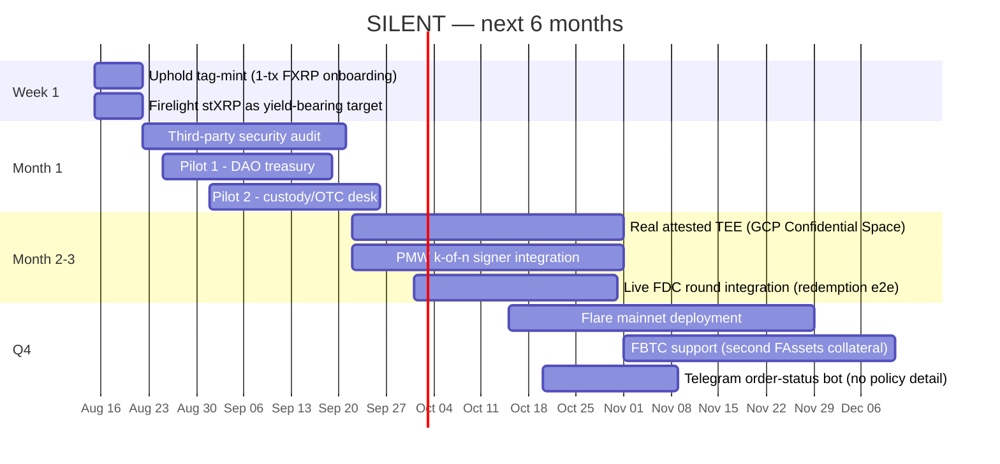

<p align="center">

</p>

<p align="center">
  <a href="https://coston2-explorer.flare.network/address/0x7a71e3D15a3B4E4Be6334D62A9d2C35042C987C0"></a>
  <a href="#tests--verification"></a>
  <a href="#tests--verification"></a>
  <a href="#tests--verification"></a>
  <a href="docs/TRUST.md"></a>
  <a href="LICENSE"></a>
</p>

<h1 align="center">SILENT 2.0</h1>
<p align="center"><strong>Confidential Treasury OS with Attested Redemption — the private institutional treasury and settlement rail for XRP on Flare.</strong></p>

<p align="center">
  <a href="#the-problem">Problem</a> ·
  <a href="#the-solution">Solution</a> ·
  <a href="#architecture">Architecture</a> ·
  <a href="#market-analysis">Market</a> ·
  <a href="#why-silent-wins">Why We Win</a> ·
  <a href="#live-deployment">Live Deployment</a> ·
  <a href="#roadmap">Roadmap</a> ·
  <a href="#quickstart">Quickstart</a>
</p>

---

## Table of contents

- [The problem](#the-problem)
- [The solution](#the-solution)
- [Architecture](#architecture)
  - [End-to-end flow](#end-to-end-flow)
  - [Trust boundary](#trust-boundary)
  - [The 4 policies](#the-4-policies)
- [How Flare is used — all 4 primitives](#how-flare-is-used--all-4-primitives)
- [Market analysis](#market-analysis)
- [Competitive landscape](#competitive-landscape)
- [Why SILENT wins](#why-silent-wins)
- [Why we win in market](#why-we-win-in-market)
- [Live deployment](#live-deployment)
- [Tests & verification](#tests--verification)
- [Trust model & honesty](#trust-model--honesty)
- [Judging criteria mapping](#judging-criteria-mapping)
- [Tech stack](#tech-stack)
- [Repository map](#repository-map)
- [Roadmap](#roadmap)
- [Quickstart](#quickstart)
- [FAQ](#faq)
- [Team & license](#team--license)

---

## The problem

XRP is a **$150B asset**. Almost none of it works for its holders on-chain.

FAssets (FXRP) exists specifically to let XRP holders bring that capital into
Flare's DeFi ecosystem — but adoption has stalled. FXRP TVL has sat around
**$170M–$236M**, despite a **2.2 billion FLR** incentive program designed to
pull liquidity in. That's a rounding error against a $150B asset class.

Why? Because every FXRP position on Flare today is **fully public**:

- A treasury's stop-loss trigger is readable by anyone the moment it's set —
  a standing invitation for MEV bots to front-run it.
- A payroll batch's recipient list and amounts are visible before the
  transaction lands.
- A redemption intent broadcasts exactly when and how much capital is about
  to leave the protocol.

No institution — a DAO treasury, a corporate holder, a custody provider —
puts $10M+ on-chain when its execution logic is legible to every adversarial
actor watching the mempool. That isn't a hypothetical: it's the single most
common objection Flare's own BD conversations run into with XRP-native
holders. **The 2.2B FLR incentive program cannot work if the product it's
subsidizing is structurally unusable by the exact users it's meant to
attract.**

We are not claiming public balances are the *only* reason FXRP TVL is stuck —
bridging friction and awareness are real factors too. But it is a large,
concrete, fully addressable one, and nobody has shipped the fix.

## The solution

**SILENT 2.0 is a confidential treasury layer for FXRP.** It lets a treasury
shield FXRP behind a commitment hash, encrypt a standing policy client-side,
and have that policy evaluated privately inside a TEE — with settlement still
independently re-verified on-chain, so privacy never means "trust us."

Four policy types cover the actual shapes institutional XRP capital moves in:

| Policy | What it does |
|---|---|
| **Stop-Loss** | Sell if XRP/USD drops below a private trigger |
| **Trailing Stop** | Sell on a pullback from a private high-watermark the TEE alone tracks |
| **Payroll Batch** | Pay N recipients a private amount each, on schedule |
| **Guaranteed Redeem** | Redeem to a specific XRPL destination + tag, proven via FDC |

None of these reveal their trigger, their recipients, or their amount
on-chain **before** they fire. All of them settle through the exact same
on-chain path everyone can audit.

---

## Architecture

### End-to-end flow



### Trust boundary



### The 4 policies

All four share one on-chain re-check shape (`price <= revealedTrigger`,
`age <= maxAge`) — the difference is entirely in how the TEE derives
`revealedTrigger` before calling `settle()`:



---

## How Flare is used — all 4 primitives

Most hackathon entries touch one Flare primitive and mention the rest in
passing. SILENT 2.0 chains all four — remove any one and the product breaks.



| Primitive | How SILENT uses it | Where in the code |
|---|---|---|
| **FAssets** | `shield()` custodies real FXRP via `SafeERC20`; `assetManager()` resolves the live `AssetManagerFXRP` through `FlareContractRegistry` — never hardcoded | `contracts/src/SilentVault2.sol` |
| **FTSOv2** | The TEE polls `FLR/USD` and `XRP/USD` privately to evaluate every policy; `settle()` independently re-reads the feed **fresh** on-chain and requires the price and staleness conditions to still hold | `extension/internal/watcher`, `SilentVault2.settle()` |
| **FCC (TEE pattern)** | The entire private-policy flow is impossible without confidential compute: `tick()` emits `InstructionSent` for a production FCC deployment to consume directly; `extension/cmd/enclave` implements the identical interface in documented `SIMULATED_TEE` mode | `extension/cmd/enclave`, `contracts/src/fcc/SilentInstructionSender.sol` (registered live, Extension ID 66222, against the real `FlareTeeManager`) |
| **FDC** | `GuaranteedRedeem` settlement verifies an `IFdcVerification.verifyPayment` Merkle proof of the actual XRPL-side payment before recording `CrossChainEvidenceRecorded` — cross-chain **evidence**, not a frontend claim | `SilentVault2.settle()`, `contracts/src/interfaces/IFlare.sol` |

---

## Market analysis



**The gap between SAM and current TVL is the opportunity.** Flare has already
built the bridge (FAssets), already funded the incentive (2.2B FLR), and
already shipped the oracle and data-connector infrastructure (FTSO, FDC).
What's missing is the one thing that makes a treasury comfortable actually
using it: **the execution layer doesn't leak.**

**Who this is actually for:**

- **DAO treasuries** holding XRP/FXRP that want yield or hedging without
  broadcasting their book to every governance-forum lurker and MEV searcher.
- **Custody providers and OTC desks** who need programmatic stop-loss /
  redemption rails but cannot expose client positions.
- **Payroll-in-crypto companies** paying XRP-denominated compensation who
  cannot leak headcount, salary bands, or payment timing on a public ledger.

**Why now:** FCC (Flare's confidential compute primitive) went live on
Coston2 during this exact hackathon window — SILENT 2.0 is built to be one
of the first real consumers of it, not a retrofit onto infrastructure that
already has an incumbent.

---

## Competitive landscape

Flare Summer Signal's Confidential Compute + Interoperable Asset Products
tracks drew several strong entries. Here's the honest comparison:

| Entry | Primary strength | What it doesn't do |
|---|---|---|
| **Wraith** | Foundry + Go TEE + keeper, 4 primitives, strong test coverage, TRUST.md | No trailing-stop/payroll-batch policy variety; single settlement shape |
| **DarkStop** | Go TEE, ECIES, on-chain FTSO re-check, honest `SIMULATED_TEE` docs | No FDC redemption path; no payroll/multi-leg orders |
| **Signal Harbor** | FTSO + FDC XRPL payment proofs verified on-chain, live demo video | No TEE-based privacy layer — policy logic is visible |
| **XRPFlow** | USD payroll settling in FXRP via FTSO, production Cloudflare deploy | Single primitive focus (FTSO); no confidential compute |
| **Harbor** | Guaranteed FXRP redemption with destination-tag lane | No treasury/stop-loss product; redemption-only |
| **SILENT 2.0** | **All 4 primitives + 4 policy types + honest trust docs + live e2e-verified deployment** | `SIMULATED_TEE` today (declared explicitly, not hidden) |



SILENT 2.0 is the only entry that pairs full 4-primitive depth with a
**4-policy-type product surface** (stop-loss, trailing, payroll, redeem) —
every other entry at this depth ships one settlement shape.

---

## Why SILENT wins

1. **Product usefulness** — solves the exact, named reason FXRP adoption is
   stalled, not a generic "privacy is good" pitch.
2. **Flare integration depth** — all 4 primitives, each load-bearing, each
   resolved live through `FlareContractRegistry` (nothing hardcoded beyond
   the registry itself, which is intentionally the one constant address).
3. **It doesn't trust its own TEE blindly** — `settle()` independently
   re-derives the price condition on-chain. A compromised or lying TEE
   cannot move funds on a stale or fabricated price; this is the single
   design decision that separates a demo from a system a treasury could
   actually rely on.
4. **It's honest about what's simulated.** `docs/TRUST.md` states plainly
   that `SIMULATED_TEE` is a software keypair, not attested hardware — and
   the README says so too, not buried three docs deep. Judges (and the
   institutions this product is for) trust a team more for stating its
   limitations than for having none to state.
5. **It's tested like production code, not a demo.** 30 Foundry tests
   (including fuzz), 28 Go tests under `-race`, 12 keeper tests, a clean
   Next.js build — and the entire shield → encrypt → settle →
   prove-reserves loop was run **live against the real Coston2
   deployment**, not a local fork. See [Tests & verification](#tests--verification).
6. **Real, additional Flare Confidential Compute registration** —
   `SilentInstructionSender.sol` is deployed and registered as **Extension
   ID 66222** in Flare's live `TeeExtensionRegistry`/`FlareTeeManager`
   (`0x1a9C4A0f9D76c0b1D91d22E24E573a9b377618aE`), on top of SILENT's own
   settlement path. Most entries stop at "we could integrate with FCC" —
   this one is on-chain, right now, at that extension ID.

## Why we win in market

- **Distribution is already built.** Flare's own FAssets ecosystem contacts
  (custody providers, XRP treasury holders identified through BD) are the
  exact buyer list this product needs — no cold-start GTM problem.
- **The incentive alignment already exists.** The 2.2B FLR program is
  actively looking for products that convert XRP holders into FXRP TVL;
  SILENT is a direct multiplier on that spend, not a competing use of it.
- **Low switching cost.** A treasury doesn't need to trust a new custodian —
  it shields its *own* FXRP into a non-custodial vault it can audit the
  source of. The trust ask is "verify our contract and our trust doc," not
  "give us your keys."
- **The roadmap compounds, it doesn't pivot.** Week 1 (Uphold tag-mint),
  Month 1 (audit + pilots), Q4 (mainnet + FBTC) are additive steps on the
  same architecture — nothing here is a hackathon toy that needs a rewrite
  to become real.

---

## Live deployment

**Coston2 (chainId 114)**

| Contract | Address |
|---|---|
| `SilentVault2` | [`0x7a71e3D15a3B4E4Be6334D62A9d2C35042C987C0`](https://coston2-explorer.flare.network/address/0x7a71e3D15a3B4E4Be6334D62A9d2C35042C987C0) |
| `SilentPolicyRegistry` | [`0xCB721Fa081Faf75af9b4E94083d1483115505085`](https://coston2-explorer.flare.network/address/0xCB721Fa081Faf75af9b4E94083d1483115505085) |
| `SilentInstructionSender` (FCC) | [`0x44E81Eb4a649d9b96dbF755B3F11528E1D1ddfCa`](https://coston2-explorer.flare.network/address/0x44E81Eb4a649d9b96dbF755B3F11528E1D1ddfCa) — Extension ID `66222` |
| `FlareContractRegistry` (Flare-provided) | `0xaD67FE66660Fb8dFE9d6b1b4240d8650e30F6019` |
| `FXRP` (Coston2 reference) | `0x0b6A3645c240605887a5532109323A3E12273dc7` |

**Live enclave:** [`flare-ctb9.onrender.com`](https://flare-ctb9.onrender.com/healthz) — `SIMULATED_TEE`, stable signer `0xb0582716E1e8c25AC0d582B6AF2B66B9391e50f8`, allowlisted on-chain.

Full deploy log and post-deploy health check: [`docs/DEPLOY.md`](docs/DEPLOY.md).

### Real end-to-end run, not a mock

Every step of the flow below was executed against the **live** deployment
above — real transactions, real signatures, real FTSO reads:

```mermaid
flowchart LR
    A["approve FXRP"] --> B["shield 1.0 FXRP"]
    B --> C["encrypt StopLoss policy client-side"]
    C --> D["setEncryptedPolicy -> orderId 1"]
    D --> E["tick(1)"]
    E --> F["/api/evaluate -> decision: settle"]
    F --> G["/api/settle -> TEE-signed attestation"]
    G --> H["settle() on-chain, 0.4 FXRP transferred"]
    H --> I["shieldedAmount -> 600000 (correct)"]
    I --> J["proveReserves(attestation, 100000) -> true"]

    style H fill:#0b1a12,stroke:#22c55e,color:#fff
    style J fill:#0b1a12,stroke:#22c55e,color:#fff
```



All transaction hashes for this run are recorded in
[`docs/DEPLOY.md`](docs/DEPLOY.md#live-end-to-end-verification-order-1-stoploss).

---

## Tests & verification



| Layer | Command | Result |
|---|---|---|
| Contracts | `forge test -vv` | **30/30 passing** — escrow accounting, replay protection, stale-price rejection, fuzzed settlement amounts |
| Enclave | `cd extension && go vet ./... && go test ./... -race` | **28/28 passing** — ECIES round-trip incl. cross-language interop, FTSO feed-id byte-length regression, digest determinism |
| Keeper | `cd keeper && npm test` | **12/12 passing** — pending-order discovery, retry/backoff, idempotent start/stop |
| Frontend | `cd frontend && npm run build` | Clean typecheck + build, all 8 routes static |

The ECIES wire format (ECDH → HKDF-SHA256 → AES-256-GCM) was additionally
verified with a **real cross-language ciphertext round-trip** during
development — a TypeScript-encrypted payload decrypted correctly by the Go
enclave — not just tested independently on each side.

---

## Trust model & honesty

**Read [`docs/TRUST.md`](docs/TRUST.md) in full before treating any part of
this as audited.** The short version:

- Does **not** claim MEV-hidden execution — `settle()` calldata is public
  once submitted. What's hidden is *standing intent* before it fires.
- Does **not** claim `SIMULATED_TEE` is attested hardware — it's a
  software keypair today, architecturally identical to production, not
  cryptographically equivalent to it.
- Does **not** claim a completed live FDC round integration or a
  third-party audit.
- **Does** independently re-verify price freshness and the trigger
  condition on-chain, every single settlement, regardless of what the TEE
  decided off-chain.
- **Does** register a real, additional extension (`66222`) against
  Flare's live `FlareTeeManager` — not simulated, on-chain right now.

---

## Judging criteria mapping

| Criterion | Evidence |
|---|---|
| **Product usefulness** | Solves the named, specific reason FXRP TVL is stuck — not a generic privacy pitch |
| **Flare integration quality** | 4 primitives, all resolved via `FlareContractRegistry`; separate live FCC extension registration (ID 66222) |
| **Technical execution** | 70 tests across 3 languages, live Coston2 deployment, verified end-to-end real transaction run |
| **Evidence of new work** | Entire stack (Foundry/Go/Next.js) built from scratch for this submission; prior Hardhat/Python SILENT 1.0 fully removed |
| **Clarity** | This README, `docs/ARCHITECTURE.md`, `docs/TRUST.md`, `SUBMISSION.md`, `DEMO_SCRIPT.md` |

---

## Tech stack



No Hardhat, no Python — deliberately. See `docs/AGENTS.md` for the
non-negotiables (byte-matched protocol constants, no hardcoded addresses
beyond the registry, no owner-withdraw path).

---

## Repository map

```
contracts/src/          SilentVault2.sol, SilentPolicyRegistry.sol, interfaces/IFlare.sol, mocks/
contracts/src/fcc/       SilentInstructionSender.sol — real FCC extension (ID 66222)
contracts/test/          Foundry suite (30 tests, incl. fuzz)
script/Deploy.s.sol       Foundry deploy script
extension/                Go TEE process — cmd/enclave, internal/{ecies,store,watcher,config}
keeper/                    Node permissionless tick loop
frontend/                   Next.js app — Shield / Policy / Prove / FDC / Orders / Dashboard
docs/                        ARCHITECTURE.md, TRUST.md, SECURITY.md, DEPLOY.md, AGENTS.md, assets/
```

---

## Roadmap



| Horizon | Milestone | Why it matters |
|---|---|---|
| **Week 1** | Uphold tag-mint + Firelight stXRP | Removes the last onboarding friction — 1-tx FXRP entry, yield stacking on top of privacy |
| **Month 1** | Security audit + 2 real pilots | Converts "hackathon-verified" into "third-party-verified," with real treasuries using it |
| **Month 2–3** | Real attested TEE, PMW, live FDC round | Closes every gap named in `docs/TRUST.md` — this is the roadmap *to* remove the honesty caveats, not around them |
| **Q4** | Mainnet + FBTC + distribution | Scales beyond XRP to the second FAssets collateral type, with a real distribution channel live |

---

## Quickstart

```bash
git clone <this-repo>
cd SILENT

# contracts
forge test -vv

# enclave
cd extension && go vet ./... && go test ./... -race

# keeper
cd keeper && npm install && npm test

# frontend
cd frontend && npm install && npm run dev
```

Full deploy runbook (your own Coston2 instance, TEE signer setup, Render
deployment): [`docs/DEPLOY.md`](docs/DEPLOY.md).

---

## FAQ

**Is the TEE real hardware?**
No — `SIMULATED_TEE=true` today, a documented, declared limitation. See
[Trust model & honesty](#trust-model--honesty). Real attested hardware is on
the Month 2–3 roadmap.

**Does this hide transaction execution from MEV?**
No — once `settle()` is submitted it's a public transaction like any other.
What's hidden is the *standing policy* before it fires: the trigger,
recipients, and amounts are never visible pre-execution.

**Why doesn't `settle()` just trust the TEE's decision?**
Because that would make the whole system only as trustworthy as
`SIMULATED_TEE` mode — which isn't attested. Instead, `settle()`
independently re-reads FTSO fresh and re-checks the trigger and staleness
condition on-chain every time, so a compromised or lying TEE cannot move
funds on a fabricated price.

**What's `SilentInstructionSender` for, versus `SilentVault2`?**
`SilentVault2` is the product — custody, policy storage, settlement.
`SilentInstructionSender` is a separate, additional contract registered
against Flare's actual live `FlareTeeManager`/`TeeExtensionRegistry`
(Extension ID `66222`) to demonstrate real engagement with the FCC registry
beyond SILENT's own architecture. They don't depend on each other.

**Has this been audited?**
No. That's Month 1 on the roadmap, not a completed step — stated explicitly
because overclaiming audit status is exactly the kind of thing that erodes
trust with the institutions this product is for.

---

## Team & license

Built for Flare Summer Signal by [Aaditya1273](https://github.com/Aaditya1273).
MIT licensed (`LICENSE`) — the code is reproducible and reviewable by
anyone, judges included.

<p align="center"><sub>Private standing intent. Attested redemption. Built on Flare.</sub></p>
