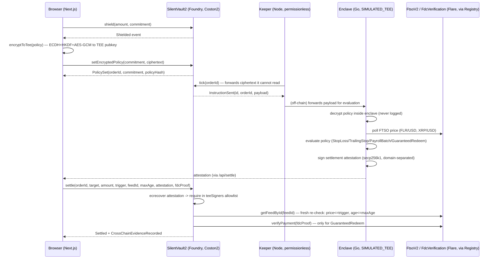

# ARCHITECTURE.md — SILENT 2.0

## System diagram



## Why this shape

The core design constraint: **the chain must never see a policy's plaintext,
but must still be the only thing that can authorize moving funds.** That
splits into two halves that meet at exactly one point — `settle()`'s
attestation check:

1. **Everything before settlement is either public-but-meaningless
   (commitments, ciphertext, event payloads) or private-and-off-chain
   (the decrypted policy, the FTSO price history, the trailing
   high-watermark).** The keeper only ever forwards ciphertext; it has no
   decryption key and needs none, because `tick()` is a pure re-broadcast.
2. **Settlement re-derives everything it needs from on-chain state rather
   than trusting the TEE's off-chain math.** `settle()` doesn't ask "did the
   TEE say to do this" and stop there — it independently reads a *fresh*
   FTSO price and requires `price <= revealedTrigger` and
   `block.timestamp - priceTs <= maxAge`. A stale or since-reverted
   off-chain decision literally cannot execute, because the contract redoes
   the price check itself. This is the single design choice that beats a
   "trust the oracle" pattern.

## Byte-level protocol coupling

Three languages (Solidity, Go, TypeScript) all need to agree on the exact
same signed digest, or attestations silently fail to verify. The coupling
points, and where they're pinned:

- `OP_TYPE_SILENT = 0x04`, `OP_COMMAND_EVAL = 0x01`, `OP_COMMAND_SETTLE = 0x02`,
  `OP_COMMAND_PROVE = 0x03` — defined in `contracts/src/SilentVault2.sol` and
  `extension/internal/config/config.go`, asserted equal by
  `extension/internal/config/config_test.go:TestOpCodesMatchSolidity`.
- The `settle()` digest — `abi.encodePacked(OP_TYPE_SILENT, OP_COMMAND_SETTLE,
  vault, chainId, orderId, commitment, target, amount, trigger, feedId,
  maxAge)` — is reconstructed field-for-field in Go
  (`extension/cmd/enclave/main.go:settleDigest`) and in the Foundry test
  suite (`contracts/test/SilentVault2.t.sol:_digest`), both asserted to
  produce the exact signature the contract accepts.
- The ECIES wire format (65-byte uncompressed ephemeral pubkey || 12-byte
  GCM nonce || AES-256-GCM(256-byte padded frame)) is implemented twice —
  `extension/internal/ecies/decrypt.go` (Go) and `frontend/lib/ecies.ts`
  (TypeScript, `@noble/curves` + `@noble/hashes` + Web Crypto) — and was
  verified by round-tripping a TS-generated ciphertext through the Go
  decrypter during development (not run automatically in CI; see
  `extension/internal/ecies/decrypt_test.go` for the same construction's
  Go-only test coverage).

## The 4 policies

All four share one on-chain re-check shape (`price <= revealedTrigger`,
`age <= maxAge`) — the difference is entirely in how the TEE derives
`revealedTrigger` before calling `settle()`:

- **StopLoss** — `revealedTrigger` is the user's fixed trigger price.
- **TrailingStop** — the TEE maintains a private high-watermark
  (`extension/internal/store.Store.UpdateHighWatermark`, never written
  on-chain) and derives `revealedTrigger = highWatermark * (1 - trailFraction)`
  each time the watermark moves; only the derived trigger is ever revealed.
- **PayrollBatch** — each recipient leg becomes its own order
  (`setEncryptedPolicy` called once per leg from the same commitment), so a
  batch settles as N independent `settle()` calls, each isolated by the
  vault's per-commitment balance accounting.
- **GuaranteedRedeem** — settlement additionally requires a non-empty
  `fdcProof` verified against `IFdcVerification.verifyPayment`, recording a
  `CrossChainEvidenceRecorded` event once the XRPL-side payment is proven.

## Repo map

```
contracts/src/        SilentVault2.sol, SilentPolicyRegistry.sol, interfaces/IFlare.sol, mocks/
contracts/test/       Foundry test suite (30 tests)
script/Deploy.s.sol   Foundry deploy script
extension/            Go TEE process (cmd/enclave, internal/{ecies,store,watcher,config})
keeper/                Node permissionless tick loop
frontend/              Next.js app (ShieldCard, PrivatePolicyCard, ProveCard, ProveFDC, OrdersCard)
docs/                  this file, TRUST.md, SECURITY.md, DEPLOY.md, AGENTS.md
```
